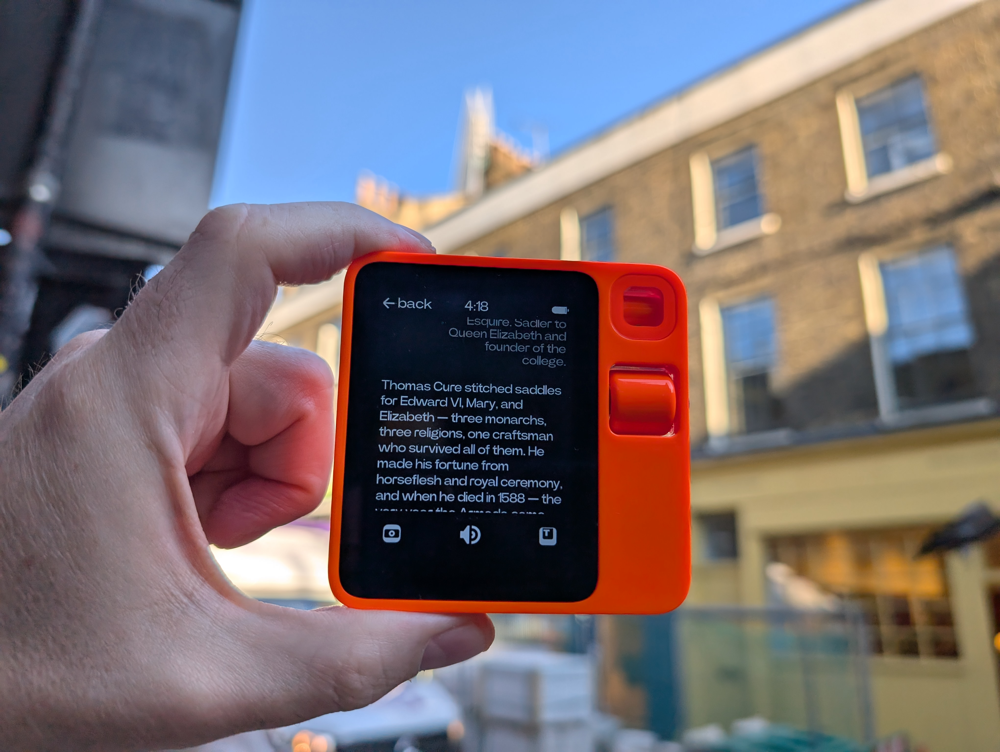
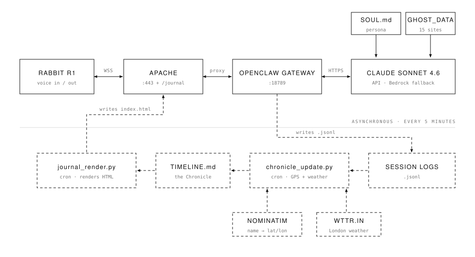

# Ghost of the City

A psychogeographical AI field journal for walking London.

You speak into a handheld voice device while walking. A self-hosted agent answers in the character of the *Ghost of the City* — a psychogeographical intelligence in the tradition of Iain Sinclair and Peter Ackroyd — telling you what stood where you're standing, what's buried under it, and where to drift next. Every exchange is logged to a Chronicle that renders as a private journal page.

It ran in London between March and September 2026. **The server has since been decommissioned; this repository is the archive.**



---

## How it worked

<picture>
  <source media="(prefers-color-scheme: dark)" srcset="images/architecture-dark.svg">
  
</picture>

There are two loops, and they run at different speeds.

**The live one** is a conversation: you speak, it goes over a websocket to Apache, through the gateway to Claude with `SOUL.md` and `GHOST_DATA.csv` as context, and the reply comes back the same way — three or four sentences, spoken aloud, while you're still standing there.

**The slow one** is bookkeeping. The gateway drops every exchange into a `.jsonl` session log. Five minutes later cron picks it up, geocodes whatever place you named, stamps it with London's weather, appends it to the Chronicle, and re-renders the journal page that Apache serves back at `/journal`.

Nothing in the live path knows the Chronicle exists. That separation is why the journal kept working when the agent didn't, and why some entries have GPS and others don't.

The device itself is just a microphone and a screen. Everything that makes it interesting is in `SOUL.md` and `GHOST_DATA.csv`.

## What's here

| Path | What it is |
|---|---|
| `SOUL.md` | The persona brief — the whole character in 30 lines |
| `GHOST_DATA.csv` | 15 London sites: layers, lost rivers, ley lines, drift suggestions |
| `scripts/` | Chronicle capture, journal rendering, GPS backfill, entry skipping |
| `config/` | OpenClaw config, Apache vhost, crontab (all redacted) |
| `journal/TIMELINE.md` | The Chronicle — every logged exchange |
| `journal/index.html` | The rendered journal, exactly as it was served |
| `docs/` | Agent scaffolding — bootstrap, tools, heartbeat |
| `images/` | Photographs from the walks |
| `screenshots/` | The journal page, desktop and mobile |

## The persona

`SOUL.md` is deliberately short. Longer briefs caused response timeouts — the agent would still be composing when the walker had moved on. The constraint turned out to be the design: three or four sentences, spoken to someone who is standing still in the cold, waiting.

```
- Tone: Atmospheric, British, observational. Use UK English.
- Conciseness: 3-4 sentences maximum. You are speaking to someone on a walk.
- Perspective: The city is a palimpsest — written on, erased, rewritten.
```

## The data

`GHOST_DATA.csv` holds 15 sites — Smithfield, Crossbones, Tyburn, Execution Dock, Bunhill Fields, the Charterhouse and others. Each carries its historical layers, any buried river beneath it, key dates, and a `drift_suggestion`: where to walk next, and why.

The agent cross-references it when you name a location, but it isn't a lookup table. Most responses are the model working from its own knowledge, with the CSV as an anchor for the sites that mattered most.

## Sample

> **You:** I'm standing looking at Smithfield Meat Market.
>
> **Ghost:** You've just walked the cart route that carried Prior Houghton to Tyburn — and now you're standing where William Wallace was executed in 1305: hung, drawn, and quartered on this ground, his head spiked on London Bridge. Wat Tyler's rebellion ended here in 1381, and between 1555 and 1558 nearly 300 Protestant martyrs were burned at the stake in front of crowds who came to watch. The fat of the executed is said to have made the cobblestones slick for days.
>
> That Victorian iron market hall you're looking at sits atop a Norman priory like a lid on a reliquary — they just kept building over the blood, which is the London way. The ground here has not been innocent for nine hundred years.

## Known rough edges

Kept as-is rather than tidied, since this is an archive of what actually ran:

- **Two entry formats coexist in `TIMELINE.md`.** The agent wrote its own entries directly (with a location and reflection line), bypassing `chronicle_update.py`, so those got no GPS or weather.
- **The renderer's second branch is dead code.** `render_entry()` checks for a `Ghost:` line first, and agent-written entries have one — so the `.location` and `.reflection` styles never render. Zero occurrences in the final output.
- **Most tags don't render.** The renderer only keeps tags beginning with `#`, but most entries wrote them semicolon-separated without hashes.
- **`chronicle_update.py` fetches weather per entry**, and stamps *current* London weather onto backdated ones.
- **Duplicate entries** when the device retried on a connection hiccup — `skip_entry.py` was the manual cleanup.

## Running it yourself

You'd need [OpenClaw](https://github.com/openclaw/openclaw) on a small VPS, an Anthropic API key, a reverse proxy with TLS, and any device that can hold a websocket and a microphone.

`config/openclaw.example.json` is the real config with credentials replaced by placeholders. The scripts use absolute `/home/ubuntu/...` paths as they did in production — change them for your own layout.

## A note on the photographs

All images have had EXIF metadata stripped, including GPS coordinates. The Chronicle in `journal/TIMELINE.md` does still contain approximate coordinates for the sites discussed — they're geocoded place names, not a location trace.

## Licence

This repository is split, because it's part software and mostly not.

**Code — MIT** ([LICENSE-CODE](LICENSE-CODE))
Everything in `scripts/` and `config/`. Use it, change it, ship it commercially; just keep the copyright notice.

**Writing and photographs — CC BY-NC 4.0** ([LICENSE-CONTENT](LICENSE-CONTENT))
`SOUL.md`, `GHOST_DATA.csv`, this README, `docs/`, `journal/`, `images/`, `screenshots/`. Share and adapt them with credit, but not commercially.

So: the plumbing is yours to take. The Ghost is not for sale.

© 2026 Campbell Orme
